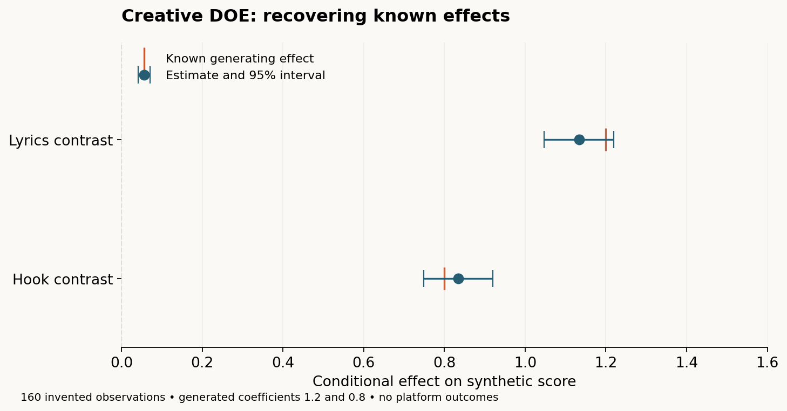

# Creative DOE

A Python library for creators and analysts who want to choose informative experiments while their creative choices change over time.



The figure uses generated data with known effects. It illustrates the model and its uncertainty, not an observed improvement on a social platform.

Built with AI coding assistance; the statistical behavior is checked with algebraic, lifecycle, and simulation tests.

Instead of testing 256 finished pieces of content as unrelated alternatives, describe the creative choices that generated them. Learn interpretable contrasts, see when the data cannot distinguish them, and choose the next few posts to improve the design.

Music content is the first example. The Python engine has no music or platform dependency. It works locally, accepts manual or CSV results, and does not post content for you.

**Status: research MVP, v0.1.** This is a working statistical tool, not a promise that an algorithm can discover causal effects from a handful of noisy posts.

## Install and run

Python 3.11 or newer:

```bash
python -m venv .venv
source .venv/bin/activate
pip install -e '.[dev,ui]'
pytest -q
python examples/music_creator/demo.py
streamlit run app/streamlit_app.py
```

In the UI, Explore a sample experiment creates 80 explicitly simulated observations in memory and works on a fresh checkout.

For the library alone: `pip install -e .`. Runtime dependencies are NumPy and SciPy; Streamlit is optional. The repository includes a [tested dependency snapshot](requirements-tested.txt) for reproducing this run, not a universal lock across all operating systems.

## A changing experiment in a few lines

```python
from creative_doe import Experiment

experiment = Experiment("Music clips", seed=42)
experiment.add_factor("lyrics", levels=[True, False], sesoi=0.3)
experiment.add_factor("hook", levels=["question", "statement"])
experiment.add_factor("font", levels=["sans", "serif"])

posts = experiment.recommend_next(n=4)

# Produce a recommended post, then measure at a consistent age.
post = posts[0]
experiment.observe(
    post["configuration"],
    numerator=320,        # viewers who reached three seconds
    denominator=1000,    # eligible starts; define consistently
    schema_version=post["schema_version"],
)
print(experiment.effects())

# This is a human decision. Retirement is not deletion or proof of no effect.
experiment.retire_factor("font", fixed_value="sans", rationale="Pause typography hypothesis")
experiment.add_factor("face_first_second", levels=[True, False])
experiment.recommend_next(n=4)

# Revisit it later; historical data and original schemas remain intact.
experiment.reactivate_factor("font", rationale="Test typography on a new visual style")
experiment.save("experiment.json")
restored = Experiment.load("experiment.json")
```

Recommendations are previews; they do not reserve runs or append observations. Request a complete batch once, execute its order, and record results before regenerating. Planned `run` numbers are sequential suggestions. Observation run numbers follow ingestion order, so **enter posts in publication order**; delayed results are not reordered automatically. Timestamps are preserved but v0.1 uses run-based time and recency. JSON is the full persistence format, including schemas. Save it before closing the UI.

### The critical rule: unknown history stays unknown

If face visibility is introduced at run 47, runs 1–46 have **no face value**. They are never converted to `False`. The current joint model excludes rows missing any required factor or context. It reports its retained sample size and exclusions. To reuse older data for older-factor questions:

```python
historical = experiment.effects(factor_ids=["lyrics", "hook", "font"])
```

That subset is a different model and may target a different period; omitting a relevant new factor can itself bias estimates. All declared contexts remain included. Retirement holds a chosen level fixed in recommendations, keeps historical coefficients, and records the rationale. Level edits create new snapshots:

```python
experiment.update_levels("font", ["sans", "serif", "mono"], rationale="Add monospace option")
```

Removed levels remain in the historical encoder. Reference levels never silently change. Numeric factors use a finite grid and categorical contrasts in v0.1, not an assumed linear trend. The lifecycle is `PROPOSED → SCREENING → ACTIVE → RETIRED`, with explicit screening/active reactivation.

## Design around real constraints

```python
from creative_doe.scheduler import Constraints

experiment.add_context("song", levels=["song_A", "song_B"])
# Historical posts without song context are now unavailable to the adjusted model.
posts = experiment.recommend_next(
    n=4,
    exploration=0.9,  # 1: learning, 0: predicted transformed performance
    contexts=[{"song": "song_A"}] * 2 + [{"song": "song_B"}] * 2,
    constraints=Constraints(
        balance=["lyrics"],
        forbidden=[{"hook": "question", "lyrics": False}],
        required=[{"face_first_second": True}],
        cooldown=1,
    ),
)
for post in posts:
    print(post["configuration"], post["reasons"], post["warnings"])
```

Each required partial pattern must occur at least once in the batch. Balanced factor level counts differ by at most one **across the batch**; balance within individual blocks is not guaranteed. Context slots are supplied by the creator and remain fixed. For within-block balance, request separate balanced batches for those blocks, or supply an appropriate candidate plan. `max_changes` plus a complete `baseline` bounds changed settings. `unique_batch=True` is the default. `cooldown=k` prevents repetition of the previous `k` configurations, including earlier selections in the proposed batch.

The scheduler enumerates at most 4,096 configurations by default. Pass `finite_candidates=[...]` for larger domains or exact feasible options. It uses greedy information scoring with bounded backtracking to satisfy hard constraints. Infeasibility and search-budget exhaustion are explicit errors; no constraints are silently relaxed. This is not a global D-optimal solver. It warns if even all feasible candidates cannot identify the chosen model.

## What is estimated?

- **Primary demo metric:** three-second hold rate, retaining numerator and denominator. Model input is `log((held + 0.5)/(starts - held + 0.5))`.
- **Model:** normal–inverse-gamma regression with Gaussian shrinkage, reference-coded main effects, optional pairwise interactions, measured context, and a linear run trend.
- **Uncertainty:** marginal Student-t credible intervals and posterior predictive intervals, conditional on the working model and chosen priors.
- **Identification:** unregularized weighted matrix rank, condition number, and general null-space aliases. An aliased effect stays labeled unidentified even if its regularized interval is narrow.
- **Learning objective:** exact Gaussian coefficient information gain **conditional on residual variance**, `0.5 log(1 + xᵀΛ⁻¹x)`. Within-batch covariance updates discourage redundant learning. This is not full joint parameter/model information.
- **Performance objective:** posterior mean on the modeled outcome scale. Learning and performance scores are separately min–max normalized over the feasible pool for each slot; their weighted mixture is an engineering utility, not information gain.
- **Nonstationarity:** optional `Experiment(..., half_life=20)` applies exponential power-likelihood discounting measured in posts. This is a working local posterior, not a fitted state-space model.

Other outcomes stay separate:

```python
from creative_doe import Metric
continuous = Experiment("Watch percentage", primary_metric=Metric("watch_pct", "continuous"))
experiment.add_metric("shares", kind="proportion")
experiment.add_metric("views", kind="count")  # modeled as log(1 + count)
# observe(..., outcomes={"hold_rate": {"numerator": 320, "denominator": 1000},
#                        "views": {"value": 1000}})
# experiment.effects(metric="views")
```

Posts receive equal base weight irrespective of impression count. This avoids treating impressions as independent creative replications, but does not model changing measurement precision. Continuous outcomes should be scaled deliberately before fitting. Prior scales are inspectable/configurable through `experiment.model`; the defaults are described in [theory](docs/theory.md).

### Interactions and factor decisions

`interaction_candidates()` proposes parent pairs only when both parents have identified exploratory evidence (at least one nonzero 95% contrast interval). `enable_interaction(a, b, rationale=...)` additionally requires full rank for the expanded matrix and at least twice as many retained posts as coefficients. This implements a conservative **strong-heredity workflow**, not a discovery guarantee. Pure interactions with weak parents can be missed; follow up with new crossed observations.

A SESOI is in modeled-outcome units. An identified contrast interval entirely inside `[-SESOI, +SESOI]` gets a **review for retirement** label. For a multilevel factor, inspect every contrast and any interactions before retiring the whole factor. There is no automatic retirement, p-value thresholding, or sparse variable-selection claim. D-design can continue allocating runs to an apparently null factor while its precision remains useful; manual retirement removes it from deliberate manipulation.

## Local UI and result import

The local workspace has five focused screens: **Overview**, **Creative choices**, **Next posts**, **Results**, and **Insights**. Start with the music starter or add your own choices using ordinary option fields. Plan posts as readable creative briefs, open a recommended post directly in the result form, and explore visual effect intervals with explicit reference comparisons.

Advanced constraints, model settings, and alias diagnostics remain available in expandable sections. Workspace settings handle new outcomes and JSON restoration; “Save a copy” downloads the full experiment. A clearly labeled simulated example is available from the empty dashboard. Mobile screens include a “Go to” navigator.

The UI requires Streamlit 1.63 or newer and uses the same Python engine as the examples. Its theme and layout live in `app/style.css` and `.streamlit/config.toml`. No JSON editing is required for ordinary creative choices, context, planning, or result entry.

CSV columns:

```text
schema_version,configuration,context,outcomes,timestamp,provenance
```

`configuration`, `context`, and `outcomes` are JSON objects inside CSV cells; use `experiment.export_csv()` for correctly quoted examples. `experiment.import_csv(text)` validates the entire import before appending. CSV does not contain schema definitions: load the matching experiment JSON first. Imports append records and do not deduplicate. Explicit unknown values use JSON `null`; missing values are excluded from affected models. There is no historical backfill/inference tool in v0.1.

## Reproducible simulation

```bash
creative-doe-benchmark --seeds 10 --runs 80
# Equivalent: python -m creative_doe.simulation.benchmark --seeds 10 --runs 80
```

The simulator has sparse and null effects, a pairwise interaction, factor introduction midway, a changing effect, song baselines, audience covariates, time trend, post-level noise, and binomial outcomes. Compare adaptive D-design (90% learning), random configurations, and repeated one-factor-at-a-time configurations on **both cumulative outcome and effect RMSE**. The confounding scenario deliberately violates treatment compliance by matching lyrics to song.

See [benchmark results](docs/benchmark_results.md), [seed-level CSV](docs/benchmark_results.csv), and [aggregate JSON](docs/benchmark_results.json). Results are small synthetic experiments, not evidence of superiority on real social media. A bandit baseline is deferred. Reproducibility is seeded for numerical outputs; audit timestamps intentionally differ between runs.

The [music example](examples/music_creator/demo.py) retires font at run 31, introduces face at run 47, and reactivates font at run 80. It writes inspectable experiment, CSV, and recommendation reports in [its output directory](examples/music_creator/output).

## Architecture and scientific limits

```text
src/creative_doe/
  factors.py, observations.py, experiment.py  # domain, audit history, persistence
  design/                                    # stable contrasts and complete cases
  models/                                    # conjugate model and model protocol
  diagnostics/                               # likelihood rank and aliases
  scheduler/                                 # feasible candidates and sequential design
  simulation/                                # hidden truth and policy comparisons
app/streamlit_app.py                          # optional local UI
```

Read [theory and primary references](docs/theory.md) and [limitations](docs/limitations.md). This package cannot randomize the platform's distribution algorithm, eliminate carryover or audience interference, or make confounded observations causal. Denominator conditioning, outcome-window selection, unobserved context, adaptive model selection, tiny samples, and temporal drift can invalidate naive interpretations.

**Mechanisms without a general validity guarantee:** interaction gating and its post-selection intervals, the normalized utility tradeoff, chosen temporal half-life, and transporting complete-case estimates across changing eras. The algebra of the conjugate model and its conditional information score is valid under its assumptions; real-platform interval calibration is unproven.

Next priorities: targeted creative-contrast design, robust/count-aware hierarchical likelihoods, explicit evolving-era/drift models, preregistered interaction validation with broader simulation calibration, and durable pending-post IDs with delayed-outcome handling.

MIT licensed. Contributions should preserve schema history, make statistical assumptions explicit, and include meaningful tests. See [AGENTS.md](AGENTS.md).

## Portfolio example

Run `python examples/music_creator/demo.py` to exercise adding, retiring, and reactivating factors. Run `python examples/music_creator/plot_effects.py` to recreate the synthetic effect-recovery figure; install plotting dependencies with `pip install -e '.[plot]'`. All source is MIT licensed. See [limitations](docs/limitations.md) before interpreting effects as causal.
